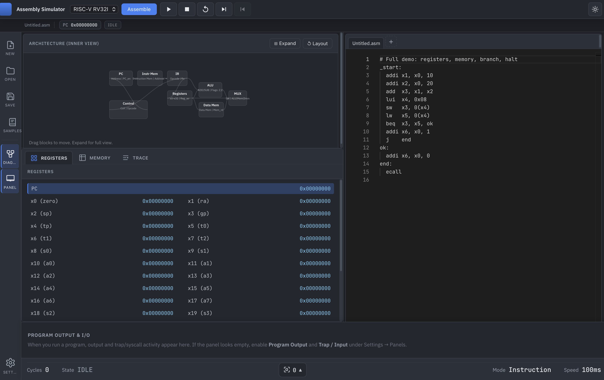
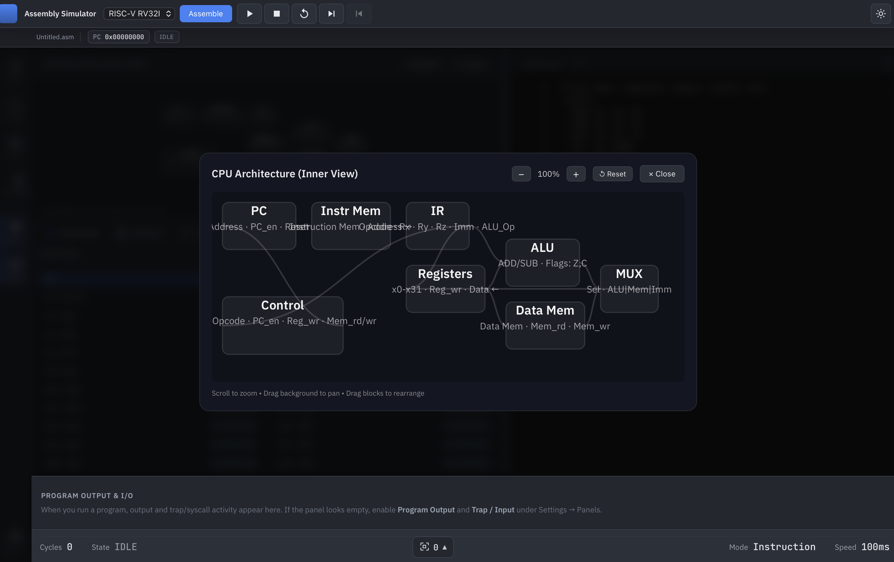
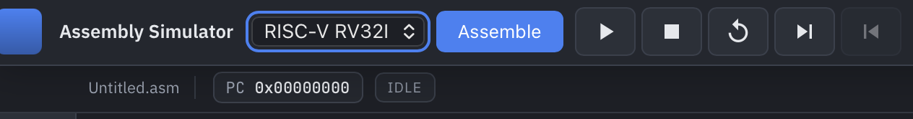

# Assembly Simulator + Architecture Visualizer

<div align="center">

**A cross-platform desktop application for learning and teaching computer architecture through interactive assembly simulation**

[](https://tauri.app/)
[](https://www.rust-lang.org/)
[](https://react.dev/)
[](https://www.typescriptlang.org/)

</div>

---

## 📖 Overview

**Assembly Simulator** is an educational desktop application designed to help students and educators understand computer architecture by simulating assembly language execution. The application provides a visual, step-by-step view of how instructions flow through a CPU pipeline, how registers change, and how memory is accessed.

### Use Cases

- **Education**: Teach computer architecture, assembly programming, and CPU internals
- **Learning**: Understand instruction execution, pipeline stages, and register/memory operations
- **Debugging**: Step through assembly code to identify bugs and understand program flow
- **Research**: Experiment with different architectures (RISC-V, LC-3, MIPS) side-by-side

### Key Features

✅ **Multi-Architecture Support**: RISC-V RV32I, LC-3, and MIPS  
✅ **Visual Pipeline**: See instructions flow through Fetch, Decode, Execute, Memory, Write-back stages  
✅ **Interactive Debugging**: Step forward/backward, breakpoints, variable-speed execution  
✅ **I/O Simulation**: Handle input/output via syscalls/traps (read char/int/string, print)  
✅ **Memory Visualization**: Hex dump with jump-to-address and configurable size  
✅ **Register Viewer**: Real-time register values with architecture-specific names  
✅ **Undo Support**: Step backward through execution (including I/O output)  
✅ **Error Highlighting**: Monaco editor with inline assembler error markers  

---

## 🖼️ Screenshots

When you add PNG files to the `screenshots/` folder (see `screenshots/README.md`), they will appear below.

### Main Interface


*Full application window: code editor, architecture diagram, registers, memory viewer, trace panel.*

### Architecture Diagram


*CPU pipeline with active stage highlighting (PC, Fetch, Decode, ALU, Memory, RegFile).*

### Step-by-Step Execution


*Stepping through code with register and memory updates and trace events.*

### Breakpoint Debugging


*Breakpoint markers in the gutter and execution paused at breakpoint.*

### I/O Interaction


*Runtime Console: Trap/Input section, Program Output, Send to Program.*

### Multi-Architecture Comparison


*Architecture selector: RV32I, LC-3, MIPS with architecture-specific register names.*

---

## 🚀 Quick Start

### Prerequisites

- **Node.js** 18+ and npm
- **Rust** (install via [rustup](https://rustup.rs/))
- **macOS** (primary target; Linux/Windows may work but not tested)

### Installation

```bash
# Clone the repository
git clone <repository-url>
cd simulator

# Install dependencies
npm install

# Run in development mode
npm run tauri:dev
```

### Building for Production

```bash
npm run tauri:build
```

The built application will be in `src-tauri/target/release/bundle/macos/` (macOS) or equivalent for your platform.

---

## 📚 Supported Architectures

### RISC-V RV32I (full base)

**ALU / Immediate**: `lui`, `auipc`, `addi`, `slti`, `sltiu`, `xori`, `ori`, `andi`, `slli`, `srli`, `srai`, `add`, `sub`, `slt`, `sltu`, `xor`, `or`, `and`, `sll`, `srl`, `sra`

**Memory**: `lb`, `lh`, `lw`, `lbu`, `lhu`, `sb`, `sh`, `sw`

**Branch**: `beq`, `bne`, `blt`, `bge`, `bltu`, `bgeu`

**Jump**: `jal`, `jalr`; pseudo: `j`, `ret`, `mv`, `li`, `nop`

**System**: `ecall`, `ebreak` (breakpoint/halt)

**System Calls** (via `ecall`, register `a7`):
- `4` = Print string (a0 = address)
- `5` = Read integer → a0
- `8` = Read string → buffer at a0, max length a1
- `10` = Exit
- `11` = Print integer (a0)
- `12` = Print character (a0)
- `13` = Read character → a0
- `93` = Exit with code (a0)

**Example**:
```asm
_start:
  addi a0, x0, 42
  addi a7, x0, 11    # print int
  ecall
  addi a7, x0, 10    # exit
  ecall
```

### LC-3

**Instructions**: `ADD`, `AND`, `NOT`, `BR`, `JMP`, `JSR`, `JSRR`, `LD`, `LDI`, `LDR`, `LEA`, `ST`, `STI`, `STR`, `TRAP`, `HALT`, `NOP`

**Directives**: `.ORIG`, `.FILL`, `.BLKW`, `.END`

**TRAP Codes**:
- `x20` = OUT (print char in R0)
- `x21` = PUTS (print string at R0)
- `x22` = IN (read char → R0, with echo)
- `x23` = GETC (read char → R0, no echo)
- `x24` = PUTSP (print string, word = two bytes low-first, stop at 0x0000)
- `x25` = HALT

**Example**:
```asm
.ORIG x3000
_start:
  TRAP x22          ; IN: read char → R0
  TRAP x20          ; OUT: print char in R0
  HALT
.END
```

### MIPS (full base)

**Instructions**: `add`, `sub`, `and`, `or`, `nor`, `xor`, `sll`, `srl`, `sra`, `sllv`, `srlv`, `srav`, `slt`, `sltu`, `slti`, `sltiu`, `addi`, `xori`, `lb`, `lh`, `lw`, `sb`, `sh`, `sw`, `beq`, `bne`, `j`, `jal`, `jr`, `jalr`, `mult`, `multu`, `div`, `divu`, `mfhi`, `mflo`, `syscall`, `li`, `lui`, `nop`. Special registers **HI** and **LO** (multiply/divide results).

**System Calls** (via `syscall`, register `$v0`):
- `1` = Print integer ($a0)
- `4` = Print string ($a0 = address)
- `5` = Read integer → $v0
- `8` = Read string → buffer at $a0, max length $a1
- `10` = Exit
- `11` = Print character ($a0)
- `12` = Read character → $v0
- `17` = Exit with value ($a0)

**Example**:
```asm
_start:
  addi $a0, $zero, 72
  addi $v0, $zero, 11    # print char
  syscall
  addi $v0, $zero, 10    # exit
  syscall
```

---

## 🎮 Usage Guide

### Writing Code

1. **Select Architecture**: Use the dropdown in the top toolbar to choose RV32I, LC-3, or MIPS
2. **Write Assembly**: Type your assembly code in the Monaco editor
3. **Use Labels**: Define labels with a colon (e.g., `_start:`, `loop:`)
4. **Comments**: 
   - RISC-V/MIPS: Use `#` for comments
   - LC-3: Use `;` for comments

### Running Programs

1. **Assemble**: Click "Assemble" to check for errors (or it happens automatically on Run)
2. **Run**: Click "Run" to execute at full speed
3. **Pause**: Click "Pause" to stop execution
4. **Step Forward**: Execute one instruction at a time
5. **Step Back**: Undo the last instruction (including I/O output)
6. **Reset**: Restart the program from the beginning

### Debugging

1. **Breakpoints**: Click in the gutter (left of line numbers) to set/remove breakpoints
2. **Breakpoint Hit**: Execution pauses automatically when PC reaches a breakpoint
3. **Inspect State**: View registers, memory, and trace events while paused
4. **Step Through**: Use Step Forward/Back to examine execution in detail

### I/O Interaction

1. **Input Request**: When a program calls a read syscall/trap, a "Trap/Interrupt Input" panel appears
2. **Enter Input**: Type your input (char, int, or string) and click "Send to Program"
3. **Output**: Printed text appears in the "Program Output" section
4. **Auto-Continue**: After sending input, execution continues automatically

### Memory Management

1. **View Memory**: Scroll through the memory hex dump
2. **Jump to Address**: Type an address (e.g., `0x3000`) and click "Jump"
3. **Change Size**: Click the settings icon (⚙) to change memory size (4KB–1MB)
4. **Memory Chunks**: For large memory (>64KB), view by chunks

---

## 🏗️ Architecture

### Project Structure

```
simulator/
├── src/                          # React frontend (TypeScript)
│   ├── components/
│   │   ├── Editor.tsx           # Monaco code editor
│   │   ├── Controls.tsx         # Run/Pause/Step buttons
│   │   ├── DiagramPanel.tsx     # Architecture diagram
│   │   ├── RegistersPanel.tsx   # Register viewer
│   │   ├── MemoryPanel.tsx      # Memory hex dump
│   │   ├── TracePanel.tsx       # Execution trace
│   │   └── RuntimeConsole.tsx   # I/O input/output
│   ├── store.ts                 # Zustand state management
│   ├── samples.ts               # Sample programs
│   └── types.ts                 # TypeScript types
│
├── src-tauri/                   # Rust backend
│   └── src/
│       ├── plugin/              # Architecture plugins
│       │   ├── mod.rs           # ArchitecturePlugin trait
│       │   ├── adapter.rs       # Architecture config/registry
│       │   ├── rv32i.rs         # RISC-V implementation
│       │   ├── lc3.rs           # LC-3 implementation
│       │   └── mips.rs          # MIPS implementation
│       ├── simulator.rs         # CPU state, undo stack, breakpoints
│       ├── memory.rs            # Memory abstraction
│       ├── commands.rs          # Tauri IPC commands
│       └── lib.rs               # Tauri app entry
│
└── README.md
```

### Architecture Plugin System

The application uses a plugin-based architecture that makes it easy to add new instruction set architectures:

1. **Implement `ArchitecturePlugin` trait**:
   - `assemble()`: Parse assembly source → binary
   - `step()`: Execute one instruction
   - `reset()`: Initialize CPU state
   - `ui_schema()`: Define diagram layout
   - `register_schema()`: Define register names

2. **Register in adapter**: Add config in `plugin/adapter.rs`

3. **Add to simulator**: Register plugin in `simulator.rs::get_plugin()`

4. **Add samples**: Create sample programs in `src/samples.ts`

### Data Flow

```
User Input (Editor)
    ↓
Frontend (React/TypeScript)
    ↓ [Tauri IPC]
Backend (Rust)
    ↓
Architecture Plugin (RV32I/LC-3/MIPS)
    ↓
Simulator (State + Memory)
    ↓
Step Result (Registers, Memory, Events)
    ↓ [Tauri IPC]
Frontend (Update UI)
```

---

## 📝 Sample Programs

### RISC-V: Hello World
```asm
_start:
  lui  a0, 0x10000      # Load address
  addi a0, a0, 72       # 'H'
  addi a7, x0, 12       # print char
  ecall
  addi a0, x0, 105      # 'i'
  ecall
  addi a7, x0, 10       # exit
  ecall
```

### LC-3: Echo Input
```asm
.ORIG x3000
_start:
  TRAP x22              ; IN: read char → R0
  TRAP x20              ; OUT: print char in R0
  ADD  R0, R0, #0
  BRz  done             ; if 0, exit
  LD   R0, newline
  TRAP x20
  BRnzp _start
done:
  HALT
newline: .FILL x000A
.END
```

### MIPS: Add Two Numbers
```asm
_start:
  addi $t0, $zero, 10
  addi $t1, $zero, 20
  add  $t2, $t0, $t1
  addi $v0, $zero, 1     # print int
  add  $a0, $zero, $t2
  syscall
  addi $v0, $zero, 10    # exit
  syscall
```

---

## 🔧 Development

### Adding a New Architecture

1. **Create plugin file**: `src-tauri/src/plugin/<arch>.rs`
   ```rust
   pub struct <Arch>Plugin;
   impl ArchitecturePlugin for <Arch>Plugin { ... }
   ```

2. **Register in `mod.rs`**: Add module and export

3. **Add config**: Update `adapter.rs::arch_config()`

4. **Register plugin**: Add to `simulator.rs::get_plugin()`

5. **Add samples**: Create samples in `src/samples.ts`

6. **Update UI**: Add architecture option in file menu

### Building

```bash
# Development
npm run tauri:dev

# Production build
npm run tauri:build

# Check Rust code
cd src-tauri && cargo check

# Format Rust code
cd src-tauri && cargo fmt
```

---

## 🐛 Known Limitations

- **Step Back I/O**: I/O output is now properly undone ✅ (fixed)
- **Memory Size**: User-configured memory size is now respected ✅ (fixed)
- **Breakpoints**: Backend breakpoint support is now implemented ✅ (fixed)
- **Platform Support**: Primarily tested on macOS; Linux/Windows may have issues

---

## 📄 License

MIT License - see LICENSE file for details

---

## 🙏 Acknowledgments

- Built with [Tauri](https://tauri.app/) for cross-platform desktop apps
- Uses [Monaco Editor](https://microsoft.github.io/monaco-editor/) for code editing
- Architecture diagrams inspired by Patterson & Hennessy's "Computer Organization and Design"

---

## 📧 Contributing

Contributions welcome! Please open an issue or submit a pull request.

---

<div align="center">

**Made with ❤️ for computer architecture education**

</div>
