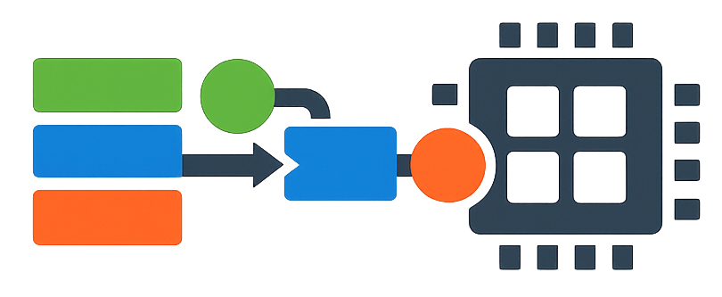
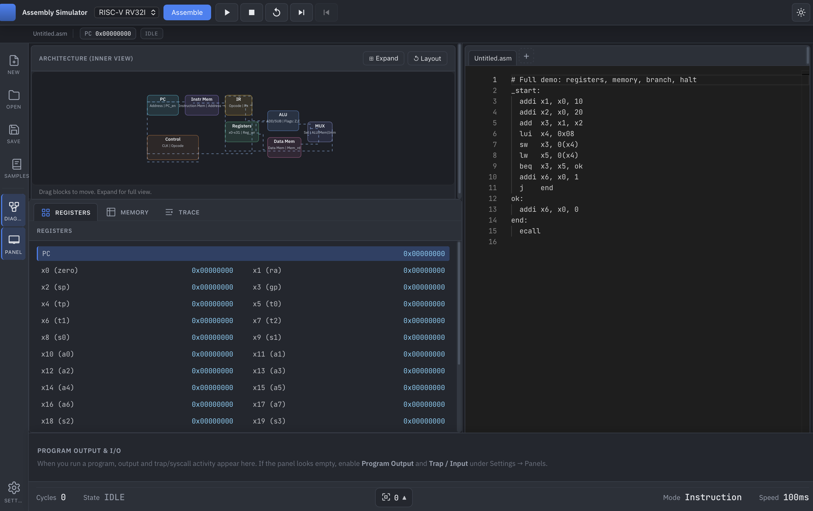
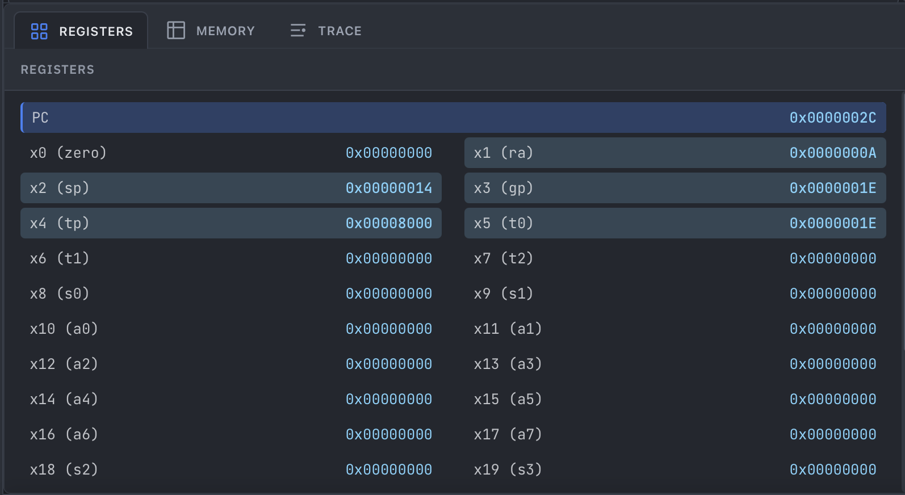
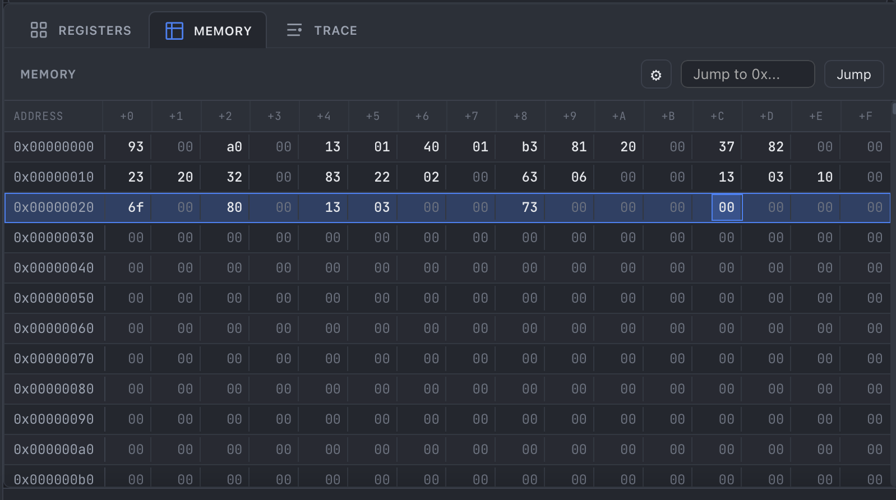
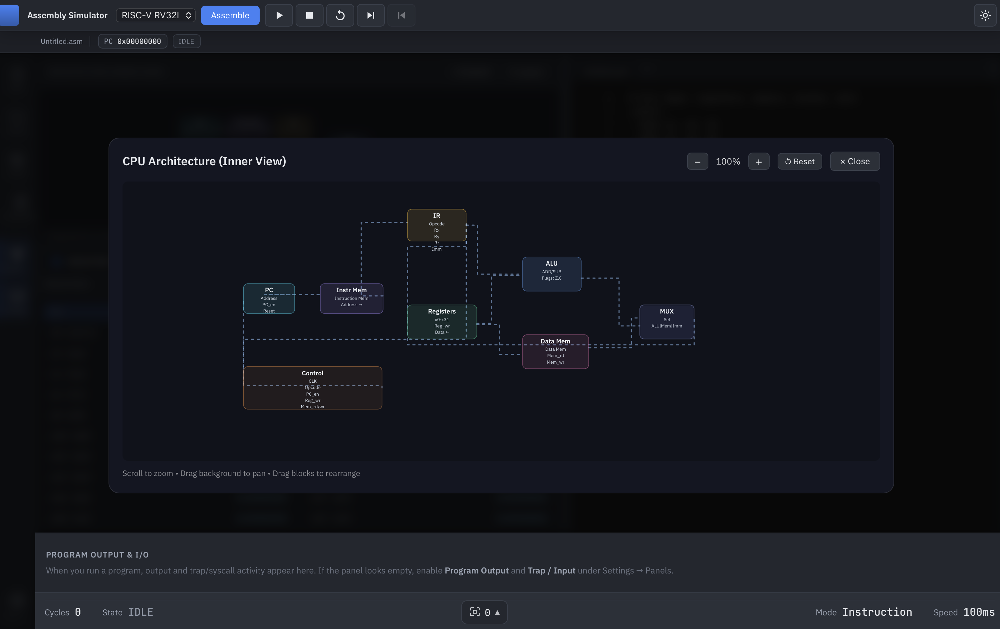
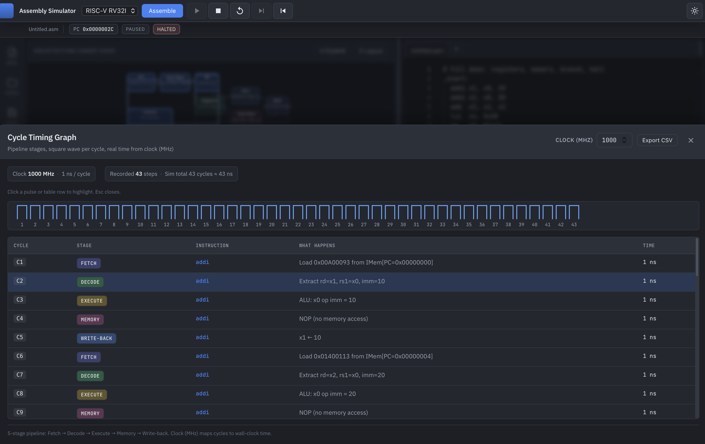
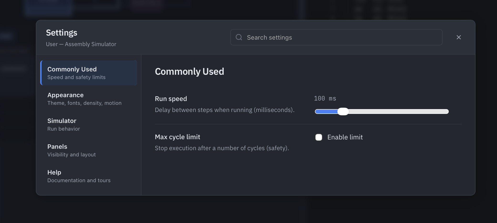

# Assembly Simulator

<p align="center">
  
</p>

**A desktop app for learning computer architecture by writing assembly, assembling, and stepping through execution—with registers, memory, pipeline trace, and an interactive CPU diagram.**

[](https://tauri.app/)
[](https://www.rust-lang.org/)
[](https://react.dev/)

---

## Table of contents

- [Who is this for?](#who-is-this-for)
- [Features](#features)
- [Requirements](#requirements)
- [Install and run](#install-and-run)
- [Using the application](#using-the-application)
- [Keyboard shortcuts](#keyboard-shortcuts)
- [Supported architectures](#supported-architectures)
- [Instruction & syscall reference](#instruction--syscall-reference)
- [Saving and opening projects](#saving-and-opening-projects)
- [Project layout](#project-layout)
- [Development](#development)
- [Contributing, license, security](#contributing-license-security)
- [Acknowledgments](#acknowledgments)
- [Screenshots](#screenshots)

---

## Who is this for?

| Audience | How it helps |
|----------|----------------|
| **Students** | See how each instruction updates the PC, registers, and memory. |
| **Instructors** | Demonstrate pipelines, traps/syscalls, and multiple ISAs in one tool. |
| **Hobbyists** | Experiment with RISC-V, LC-3, MIPS, 8085, 6502, or 8086-style assembly. |
| **Developers** | Extend the Rust plugin system with new ISAs or UI features ([CONTRIBUTING.md](CONTRIBUTING.md)). |

---

## Features

- **Multiple ISAs** — RISC-V RV32I, LC-3, MIPS, Intel 8085, MOS 6502, Intel 8086 (see [Supported architectures](#supported-architectures)).
- **Editor** — Monaco-based editor with assembler errors, breakpoints (gutter), and optional themes & fonts ([Settings](#using-the-application)).
- **Execution** — Assemble, run, pause, single-step forward **and backward** (with I/O undo where applicable).
- **Visualization** — Architecture diagram (pipeline-style blocks), registers, memory hex view, execution trace, cycle timing graph.
- **I/O** — Simulated syscalls/traps for print/read (behavior depends on ISA).
- **Desktop** — Built with [Tauri](https://tauri.app/) for a native window (not a browser tab).

---

## Requirements

| Tool | Notes |
|------|--------|
| **Node.js** | v18 or newer (includes `npm`) |
| **Rust** | Stable toolchain ([rustup.rs](https://rustup.rs/)) |
| **OS** | **macOS** is the primary tested platform. Linux and Windows often work with Tauri but may need extra setup. |

---

## Install and run

### 1. Get the code

```bash
git clone https://github.com/AMANKANOJIYA/simulator.git
cd simulator
```

### 2. Install JavaScript dependencies

```bash
npm install
```

### 3. Run the desktop app (development)

```bash
npm run tauri:dev
```

This starts the Vite dev server and opens the Tauri window with hot reload for the frontend.

### 4. Web-only UI (optional)

For a quick UI check without the Rust backend:

```bash
npm run dev
```

> Full simulation (assemble, step, run) requires **`npm run tauri:dev`** or a production build.

### 5. Production build

```bash
npm run tauri:build
```

Installers or bundles appear under `src-tauri/target/release/bundle/` (exact path depends on OS).

---

## Using the application

1. **Choose an architecture** — Toolbar dropdown (e.g. RV32I, LC-3, MIPS, 8085, 6502, 8086).
2. **Write assembly** — Main editor tab(s); use **New / Open / Save / Samples** from the **left activity bar**.
3. **Assemble** — **Assemble** checks syntax and loads the program into the simulator.
4. **Run or step** — **Run**, **Pause**, **Step forward**, **Step back**, **Reset** as needed.
5. **Breakpoints** — Click the **gutter** (left of line numbers) to toggle breakpoints; run stops when the PC hits one.
6. **Panels** — **Registers**, **Memory**, **Trace** share one tabbed area on the left; toggle **Diagram** and **Bottom panel** (console / I/O / clock) from the activity bar.
7. **Settings** — **Gear** at the bottom of the activity bar: theme, fonts, editor size, UI density, panel visibility, run speed, and more.
8. **Theme** — Moon/Sun (or similar) in the **top-right** for dark/light mode.

When a program asks for input (syscall/trap), use the **bottom panel** — enable **Trap / Input** and **Program Output** in **Settings → Panels** if sections are hidden.

---

## Keyboard shortcuts

| Shortcut | Action |
|----------|--------|
| **Ctrl/Cmd + S** | Save project (`.asim`) |
| **Ctrl/Cmd + O** | Open project |
| **Ctrl/Cmd + N** | New editor tab |
| **Esc** | Close cycle timing graph (when open) |

*(More shortcuts may be listed in **Help** inside the app.)*

---

## Supported architectures

| ID | Description |
|----|-------------|
| **RV32I** | RISC-V 32-bit integer base — `ecall`, loads/stores, branches, etc. |
| **LC-3** | 16-bit educational ISA — `.ORIG`, `TRAP`, `HALT`, etc. |
| **MIPS** | MIPS-style 32-bit subset — `syscall`, loads/stores, branches. |
| **8085** | Intel 8085 |
| **6502** | MOS 6502 |
| **8086** | Intel 8086 (real-mode style subset) |

Exact instruction sets and pseudos are implemented in `src-tauri/src/plugin/` (see filenames such as `rv32i.rs`, `lc3.rs`, `mips.rs`, `i8085.rs`, `i6502.rs`, `i8086.rs`).

---

## Instruction & syscall reference

The following summarizes common syscalls and syntax. **Always refer to in-app behavior and the Rust plugin for authoritative semantics.**

### RISC-V RV32I

**Examples**: `addi`, `lw`, `sw`, `beq`, `jal`, `ecall`, pseudos like `li`, `mv`, `nop`.

**Selected `ecall` services** (`a7` = function ID):

| a7 | Meaning |
|----|---------|
| 4 | Print string (`a0` = address) |
| 5 | Read integer → `a0` |
| 8 | Read string |
| 10 | Exit |
| 11 | Print integer (`a0`) |
| 12 | Print character (`a0`) |
| 13 | Read character → `a0` |
| 93 | Exit with code (`a0`) |

**Example:**

```asm
_start:
  addi a0, x0, 42
  addi a7, x0, 11
  ecall
  addi a7, x0, 10
  ecall
```

### LC-3

**Directives**: `.ORIG`, `.FILL`, `.BLKW`, `.END`  
**Comments**: `;`

**Common TRAPs**: `x20` OUT, `x21` PUTS, `x22` IN, `x23` GETC, `x25` HALT (see plugin for full list).

```asm
.ORIG x3000
_start:
  TRAP x22
  TRAP x20
  HALT
.END
```

### MIPS

**Syscalls** via `syscall` with `$v0`:

| $v0 | Meaning |
|-----|---------|
| 1 | Print integer (`$a0`) |
| 4 | Print string |
| 5 | Read integer → `$v0` |
| 8 | Read string |
| 10 | Exit |
| 11 | Print char |
| 12 | Read char → `$v0` |

### 8085 / 6502 / 8086

Instruction mnemonics and addressing modes follow classic references; see the corresponding `i8085.rs`, `i6502.rs`, and `i8086.rs` plugins and bundled **Samples** for examples.

---

## Saving and opening projects

- **Save** writes an **`.asim`** file (source, architecture, breakpoints, speed, panel options, etc.).
- **Open** loads a project into a new or existing tab depending on implementation.

Use the activity bar **Save** / **Open** or the keyboard shortcuts above.

---

## Project layout

```
simulator/
├── src/                      # React + TypeScript UI
│   ├── components/           # Panels, editor, controls, …
│   ├── store.ts              # App state (Zustand)
│   ├── samples.ts            # Example programs
│   └── appearance.ts         # Font stacks / appearance IDs
├── src-tauri/                # Rust + Tauri shell
│   └── src/
│       ├── plugin/           # ISA plugins (rv32i, lc3, mips, i8085, …)
│       ├── simulator.rs      # CPU state, stepping, undo
│       ├── commands.rs       # IPC commands for the UI
│       └── lib.rs
├── LICENSE
├── CONTRIBUTING.md
├── CODE_OF_CONDUCT.md
├── SECURITY.md
├── CHANGELOG.md
└── README.md                 # This file
```

---

## Development

```bash
npm run tauri:dev    # Full app
npm run build        # Typecheck + Vite build
npm run lint         # ESLint
cd src-tauri && cargo check   # Rust check
```

Adding a new architecture typically means implementing the plugin trait, registering it in the adapter, wiring samples and UI — see [CONTRIBUTING.md](CONTRIBUTING.md).

---

## Contributing, license, security

| Document | Purpose |
|----------|---------|
| [CONTRIBUTING.md](CONTRIBUTING.md) | How to report issues, submit PRs, and code style expectations |
| [CODE_OF_CONDUCT.md](CODE_OF_CONDUCT.md) | Community standards |
| [SECURITY.md](SECURITY.md) | How to report security issues privately |
| [LICENSE](LICENSE) | **MIT License** — free use with attribution |
| [CHANGELOG.md](CHANGELOG.md) | Release notes |

By contributing, you agree that your contributions are licensed under the **MIT License**.

---

## Acknowledgments

- [Tauri](https://tauri.app/) — desktop shell  
- [Monaco Editor](https://microsoft.github.io/monaco-editor/) — code editing  
- Inspired by classic computer architecture education (e.g. Patterson & Hennessy)

---

## Screenshots

### Main window


### Architecture diagram


### Editor & debugging



### Registers & memory



### Memory



### Trace



### Runtime I/O



### Settings / appearance



### Multi-architecture


---

<div align="center">

**Made for learning computer architecture**

</div>
